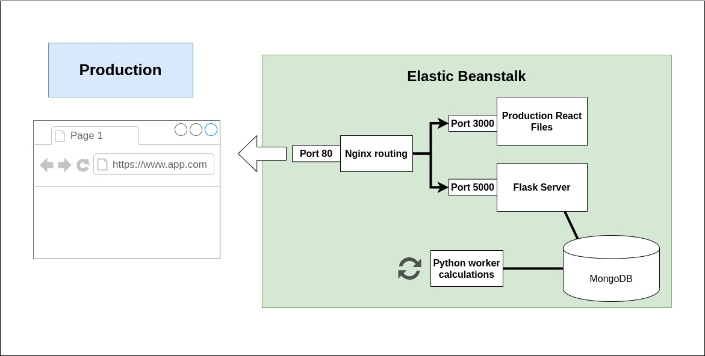

# othello_tais
Implementación online del juego Othello para la convocatoria de concurso sobre desarrollo de un juego online multijugador accesible (2017) de la Universidad de Sevilla.

La lógica del juego falla mucho, todavia hay que mejorarlo.

## Run
```
docker-compose up
```

## Developer build
```
docker-compose up -f docker-compose.dev.yml
```

## Tech stack
* Python (Numpy, Flask)
* MongoDB
* React
* Docker



## Developer
* Daniel de los Reyes Leal


## License
See license at [LICENSE](LICENSE)